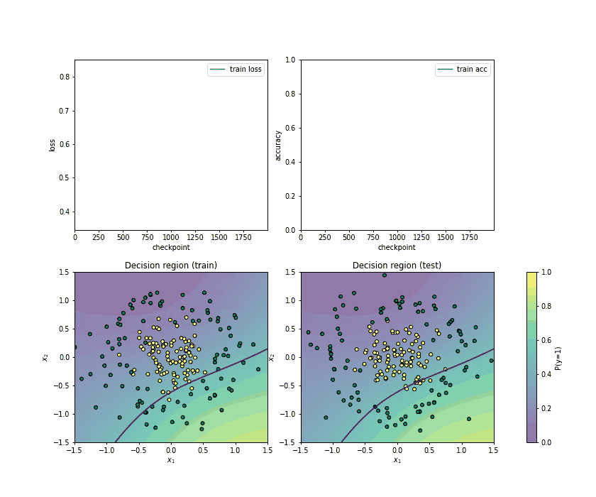

# WIP

<h1><u>A Machine Learning Introduction</u></h1>

This repository presents a three-part introduction to Machine Learning. Each part consists of a Python notebook and a PDF detailing the intuition and mathematics behind the code.

In Part 1, we create a single neuron and train it for binary classification on a linearly separable dataset.

In Part 2, we combine several of these neurons to form a layer, which we then train for binary classification on a non-linearly separable dataset.

In Part 3, we combine several layers and train them on MNIST for handwritten digit recognition.

