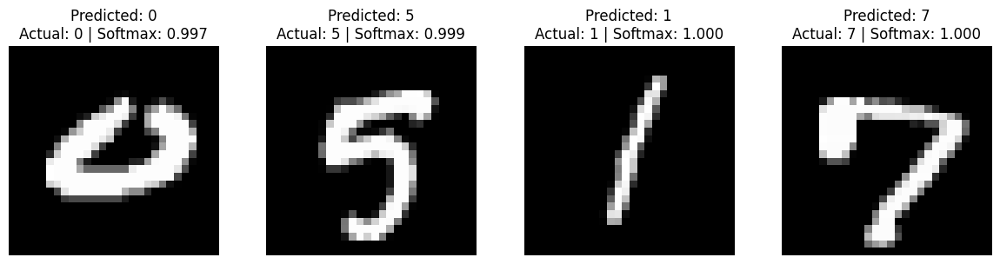

# A Machine Learning Introduction (Perceptron2MNIST)

This repository is a three-part introduction to Machine Learning, focused on building intuition by **implementing neural networks from scratch**, then transitioning to a modern deep learning framework (**PyTorch**).

Each part contains:
- a **Python notebook** (implementation + experiments)
- a **PDF** explaining the **intuition and mathematics** behind the code

---

## Contents

### Part I — Logistic Regression (Single Neuron)
We implement a single sigmoid neuron (logistic regression) **from scratch** and train it with gradient descent on a **linearly separable** binary classification dataset.

📁 `1_singleNeuron/`

---

### Part II — Multilayer Perceptron (Nonlinear Classification)
We extend Part I into a **two-layer MLP** (one hidden layer) and train it **from scratch** on a **non-linearly separable** dataset (e.g., concentric circles).  
This part includes a full visualization of how the decision boundary evolves during training.

📁 `2_mlp/`

<p align="center">
  
</p>

---

### Part III — MNIST with PyTorch (Softmax, ReLU, Validation)
Now that the fundamentals are clear, we re-implement the same ideas using **PyTorch** to train an MLP on **MNIST** (10-class digit classification).  
We introduce practical deep learning tools:
- softmax + cross-entropy
- mini-batches and epochs
- ReLU vs sigmoid comparison
- validation set + early stopping (and a discussion of cross-validation)

📁 `3_mnist/`

<p align="center">
  
</p>

---

## How to Run

Clone the repo, create a virtual environment, and install dependencies:

```bash
pip install -r requirements.txt
```

Then open the notebooks with Jupyter